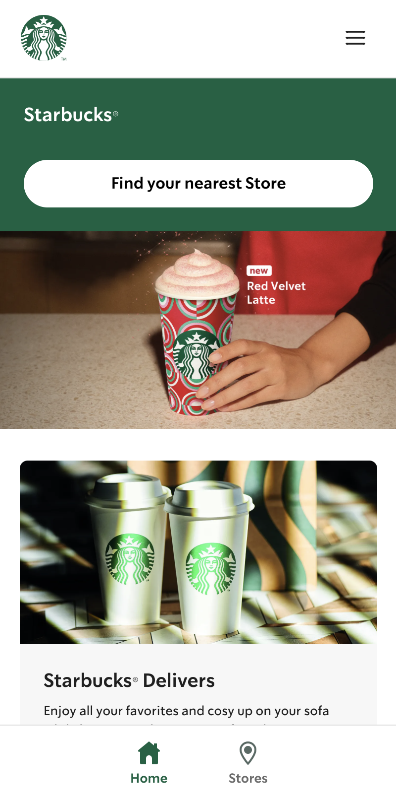
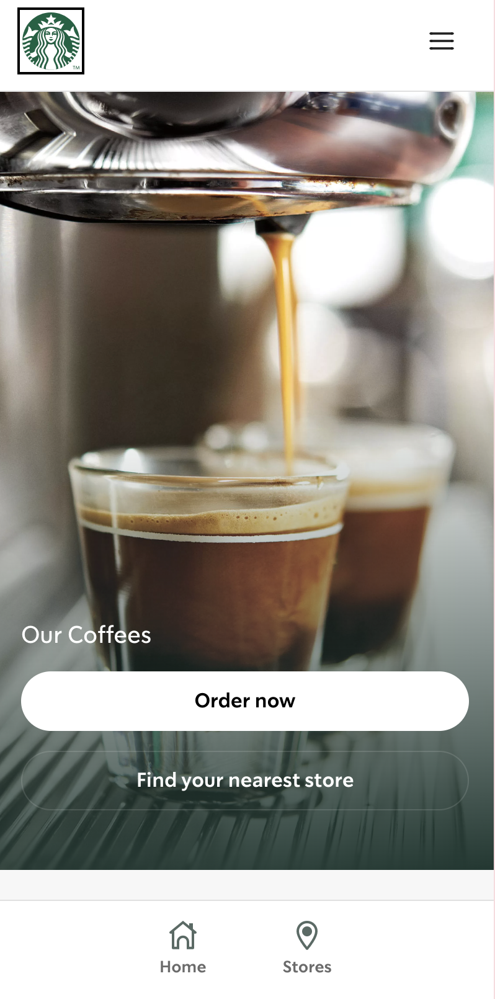
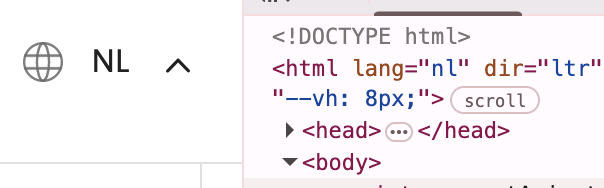
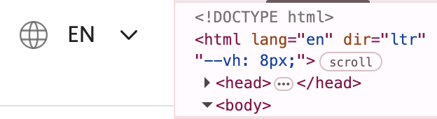
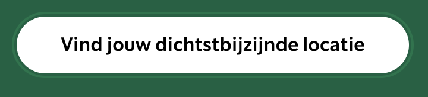
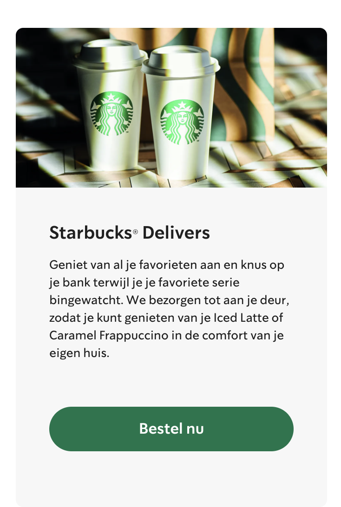
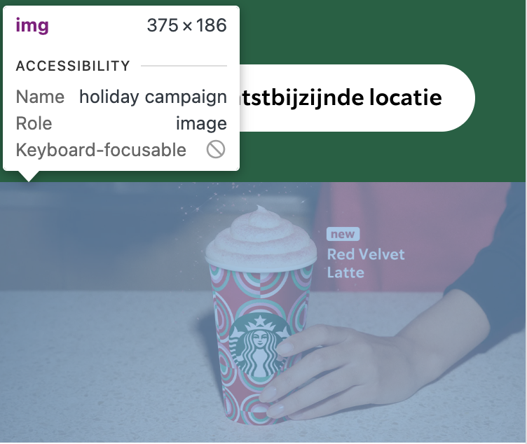
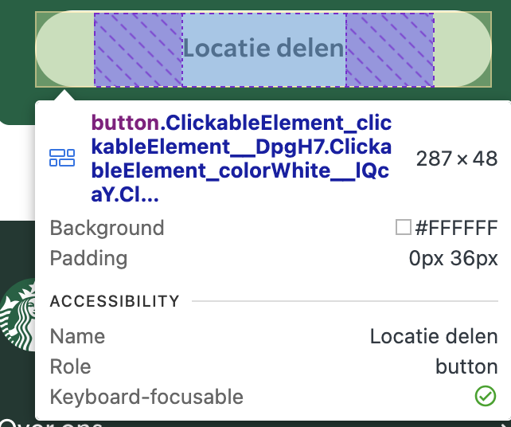
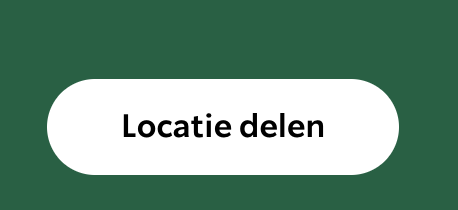
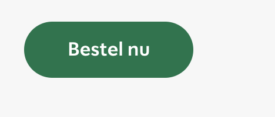

# Procesverslag
Markdown is een simpele manier om HTML te schrijven.  
Markdown cheat cheet: [Hulp bij het schrijven van Markdown](https://github.com/adam-p/markdown-here/wiki/Markdown-Cheatsheet).

Nb. De standaardstructuur en de spartaanse opmaak van de README.md zijn helemaal prima. Het gaat om de inhoud van je procesverslag. Besteedt de tijd voor pracht en praal aan je website.

Nb. Door *open* toe te voegen aan een *details* element kun je deze standaard open zetten. Fijn om dat steeds voor de relevante stuk(ken) te doen.

## Jij

  
uitwerken voor kick-off werkgroep

  ### Auteur:
  Naimah sambo

  #### Je startniveau:
  Ik zit op de blauwe pieste maar vind vormgeven van een website enorm leuk. Als ik maar iets kan doen qua vormgeving vindt ik het process al fijner.

  #### Je focus:
  
 Ik denk toch responsive en service laag. Als ik goed begrijp wat met service laag bedoelt wordt is het de vormgeving en de look van de website. Dat vindt ik belangrijk.

## Je website

  
uitwerken voor kick-off werkgroep

  ### Je opdracht:
  https://www.starbucks.com

  #### Screenshot(s) van de eerste pagina (small screen): 
  hier de naam van de pagina  
  

  #### Screenshot(s) van de tweede pagina (small screen):
  hier de naam van de pagina  
  
 

## Toegankelijkheidstest 1/2 (week 1)

  
uitwerken na test in 2e werkgroep

  ### Bevindingen screenreader
  Lijst met je bevindingen die in de test naar voren kwamen:
  -Headings worden goed gelezen door de screenreader.
  -Links moeten betere namen krijgen vooral op de home pagina, er staat nu bijvoorbeeld een button met "zie meer" maar van wat?

   ### Bevindingen WCAG
  Lijst met je bevindingen die in de test naar voren kwamen:

  -Content: op de homepagina zijn de buttons en links niet uniek.

  -Global code: Enorm veel errors in HTML, en geen duidelijke titles per pagina. De taal veranderd wel mee met de pagina:
  
  

  -Keyboard: Het is niet duidelijk genoeg waar de focus op staat door kleur contrast:

  -Mobile and touch: De website is extreem goed voor mobiel gebruik, en gebruikt grote duidelijke knoppen met genoeg afstand: 
  

  -Headings: De website maakt gebruik van headings in een duidelijke volgordere, volgends de regels en zonder een heading level te skippen.

  -Lists: De website maakt regelmatig gebruik van list items.

  -Images: Er zijn geen images zonder doel op deze website, maar maakt wel gebruikt van een alt bij img's. Alleen klopt deze alt niet altijd zoals bij het plaatje van de redvelvet latte waar "holliday campain" staat: 
  

  -Media: De website heeft geen Videos of audios.

  -Controls: Er wordt vrijwel altijd gebruik gebruik gemaakt van een a element bij een link, deze zijn dan ook te herkennen als link. Er wordt zelden gebruik gemaakt van een button element voor een button dit gebruikt maar bij één button op de homepagina: 
   

  De links openen dan ook niet op een ander tablat.
  -Appearance: Darkmode wordt niet gesupport op de website. Ook kan de text niet groter dan het standaard formaat.

  -Animation: Er zijn bijna geen animations op de website, alleen kleine subtiele dingen zoals het uitklappen van het hamburger menu wat geleidelijk gaat. 

  -Color contrast: Er is een duidelijk verschil tussen achtergrond en tekst op de website, op een donkere achtergrond wordt bijvoorbeeld gebruik gemaakt van witte tekst en andersom:
hfbbhjebhjbrbfhjbef

   

## Breakdownschets (week 1)

  
uitwerken na afloop 3e werkgroep

  ### de hele pagina: 
  

  ### dynamisch deel (bijv menu): 
  

  ### wellicht nog een dynamisch deel (bijv filter): 
  

## Voortgang 1 (week 2)

  
uitwerken voor 1e voortgang

  ### Stand van zaken
  Tijdens het maken van de opzet van mijn website gingen er veel dingen goed: het werken met flexbox, omdat nog vers in mijn geheugen zat. Het stylen van de header ging ook erg goed.
  
   
  
  En het werken met de :root (het kleuren pallet) ging ook heel goed
  
  

  Wat minder goed ging is het verplaatsen van de elementen van de zijkant af.
  
  

  Ook vond ik het lastig om te werken met grid. Het omdraaien van de elementen in de sections vond ik enorm lastig ik heb er uiteindelijk wel iets voor gevonden.

  

  ### Agenda voor meeting
  samen met je groepje opstellen

  | student 1      | student 2          | student 3    |
  | ---            | ---                | ---         |
  | dit bespreken  | en dit             | - HTML en CSS checken.   
  | en dat ook nog | dit als er tijd is | - Uitleg over de ruimte tussen elementen
  | ...            | ...                | - Uitleg over wanneer grid of flexbox 
  gebruiken op mijn website.            | - Uitleg over een fixed A met responsiveness 

  ### Verslag van meeting
  hier na afloop snel de uitkomsten van de meeting vastleggen

  - punt 1
  - punt 2
  - nog een punt
  - ...

## Voortgang 2 (week 3)

  
uitwerken voor 2e voortgang

  ### Stand van zaken
  hier dit ging goed & dit was lastig (neem ook screenshots op van delen van je website en code)

  ### Agenda voor meeting
  samen met je groepje opstellen

  | student 1      | student 2          | student 3    | student 4        |
  | ---            | ---                | ---          | ---              |
  | dit bespreken  | en dit             | en ik dit    | en dan ik dat    |
  | en dat ook nog | dit als er tijd is | nog een punt | dit wil ik zeker |
  | ...            | ...                | ...          | ...              |

  ### Verslag van meeting
  hier na afloop snel de uitkomsten van de meeting vastleggen

  - punt 1
  - punt 2
  - nog een punt
- ...

## Toegankelijkheidstest 2/2 (week 4)

  
uitwerken na test in 9e werkgroep

  ### Bevindingen
  Lijst met je bevindingen die in de test naar voren kwamen (geef ook aan wat er verbeterd is):

## Voortgang 3 (week 4)

  
uitwerken voor 3e voortgang

  ### Stand van zaken
  hier dit ging goed & dit was lastig (neem ook screenshots op van delen van je website en code)

  ### Agenda voor meeting
  samen met je groepje opstellen

  | student 1      | student 2          | student 3    | student 4        |
  | ---            | ---                | ---          | ---              |
  | dit bespreken  | en dit             | en ik dit    | en dan ik dat    |
  | en dat ook nog | dit als er tijd is | nog een punt | dit wil ik zeker |
  | ...            | ...                | ...          | ...              |

  ### Verslag van meeting
  hier na afloop snel de uitkomsten van de meeting vastleggen

  - punt 1
  - punt 2
  - nog een punt
  - ...

## Eindgesprek (week 5)

  
uitwerken voor eindgesprek

  ### Je uitkomst - karakteristiek screenshots:
  

  ### Dit ging goed/Heb ik geleerd: 
  Korte omschrijving met plaatjes

  

  ### Dit was lastig/Is niet gelukt:
  Korte omschrijving met plaatjes

  

## Bronnenlijst

  
continu bijhouden terwijl je werkt

  Nb. Wees specifiek ('css-tricks' als bron is bijv. niet specifiek genoeg). 
  Nb. ChatGpT en andere AI horen er ook bij.
  Nb. Vermeld de bronnen ook in je code.

  1. bron 1
  2. bron 2
  3. ...

